<div align="center">

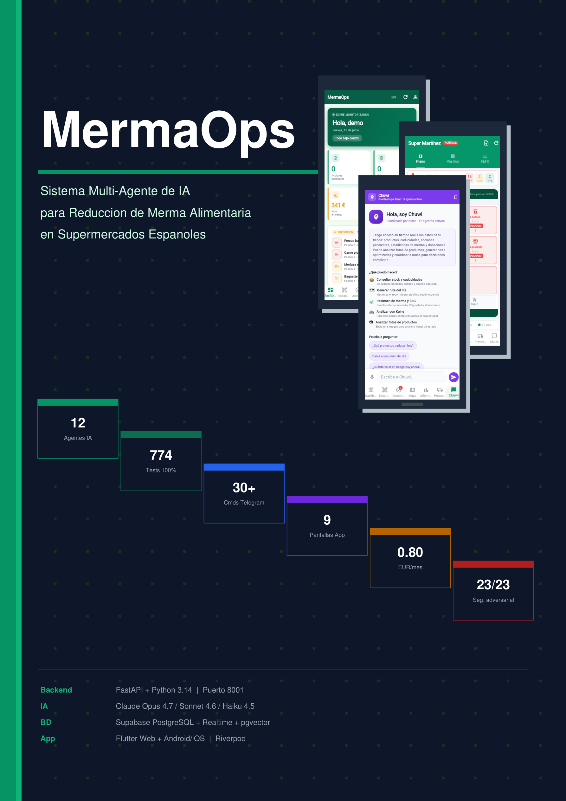

# MermaOps

### Sistema Multi-Agente de IA para Reducción de Merma Alimentaria

**TFM · Máster en IA Generativa e Innovación · Evolve Business School 2026**  
**Álvaro Ferrer Margarit**

<br/>


</div>

---

## ¿Qué es MermaOps?

El desperdicio alimentario en retail español cuesta entre **2–5% de los ingresos** por tienda — hasta **200.000 € anuales** en una cadena media. Las herramientas existentes (Winnow, Orbisk) requieren hardware caro y solo sirven para grandes cadenas.

**MermaOps** resuelve esto con IA multi-agente accesible desde Telegram y el móvil del encargado, **sin hardware adicional, sin instalación, sin coste de implantación**.

```
Producto próximo a caducar
        ↓
  Kuine (Opus 4.7) — orquestador, 16 tools, hasta 20 iteraciones
        ↓
  Evaluador · Validador · Consenso — score 0-100, 23 ataques bloqueados
        ↓
  Precio · Stock · FEFO — acción concreta calculada
        ↓
  Chuwi (Sonnet 4.6) — lo envía por Telegram en streaming real
        ↓
  Empleado actúa · App Flutter actualiza en tiempo real via Supabase Realtime
```

---

## 📱 App Flutter

<div align="center">

<table>
<tr>
<td align="center">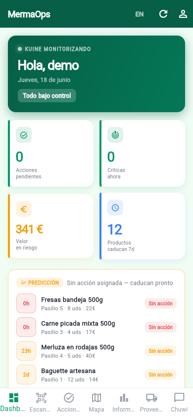<br/><b>Dashboard</b><br/>KPIs en tiempo real</td>
<td align="center">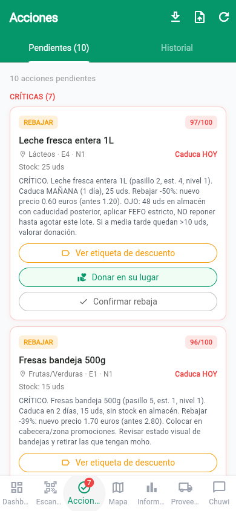<br/><b>Acciones</b><br/>Swipe to complete</td>
<td align="center">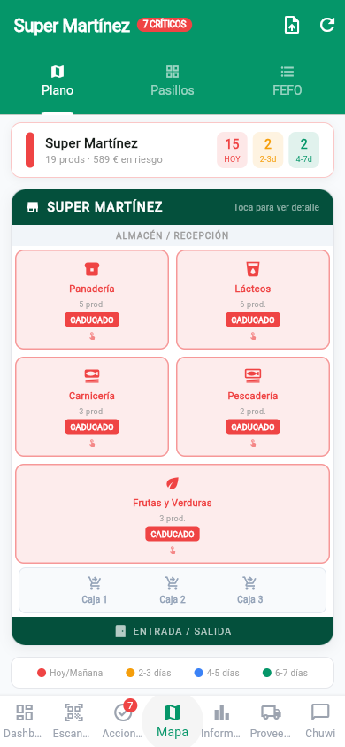<br/><b>Mapa</b><br/>Plano real CustomPainter</td>
<td align="center">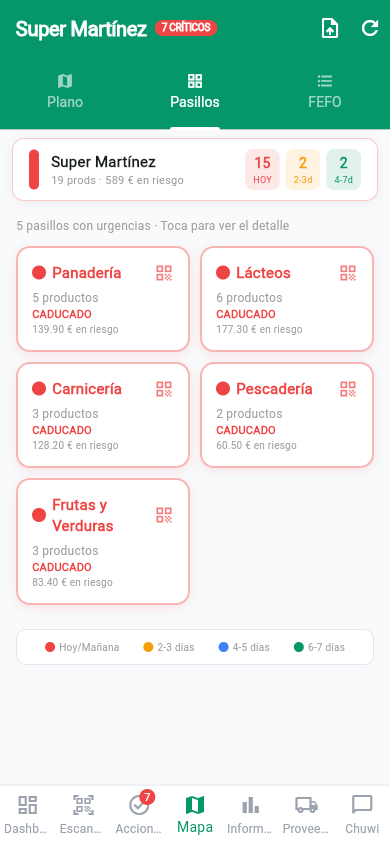<br/><b>Pasillos</b><br/>Por urgencia</td>
</tr>
<tr>
<td align="center">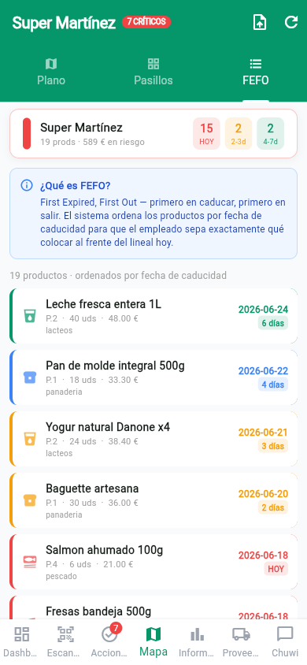<br/><b>FEFO</b><br/>Orden de rotación</td>
<td align="center">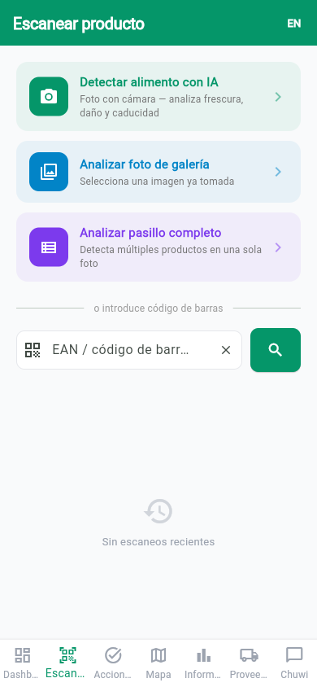<br/><b>Escanear</b><br/>Barcode + Vision IA</td>
<td align="center">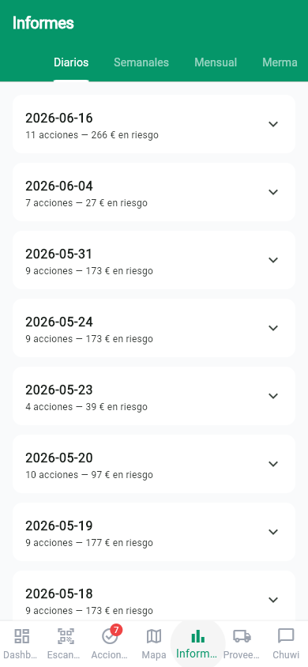<br/><b>Informes</b><br/>11 tabs · PDF · ESG</td>
<td align="center">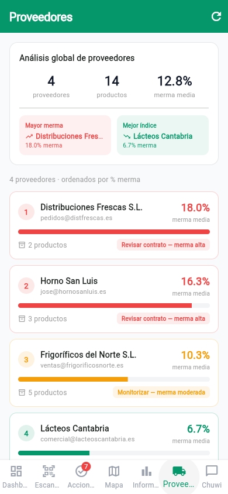<br/><b>Proveedores</b><br/>Pedido semanal IA</td>
</tr>
</table>

</div>

### 9 pantallas · Riverpod · GoRouter · Supabase Realtime

| Pantalla | Feature clave |
|----------|--------------|
| **Dashboard** | KPIs streaming Realtime, donut urgencia, área chart merma 7d, tarjeta tiempo Open-Meteo |
| **Acciones** | Swipe to complete (manager), donación con deducción fiscal 35%, export/import CSV |
| **Mapa / Plano** | CustomPainter real (almacén + 4 pasillos + Frutas&Verduras + cajas), hit-testing por zona |
| **Escanear** | mobile_scanner (Chrome BarcodeDetector API), Vision Agent Haiku, análisis en 3s |
| **Agentes** | 4 tabs: estado 12 agentes · conversaciones Chuwi · runs Kuine · decisiones con reasoning |
| **Proveedores** | Merma histórica por proveedor, pedido semanal generado por IA |
| **Almacén** | Stock, FEFO automático, alertas caducidad, movimientos a tienda |
| **Informes** | 11 tabs: PDF brief, semanal, merma, pedidos, ESG CSRD, predicciones, benchmark, insights IA |
| **Perfil** | Configuración tienda (GPS para weather), rol-based access (staff/manager/admin) |

---

## 🤖 Telegram — @ChuwiMermaOpsBot

<div align="center">

<table>
<tr>
<td align="center"><br/><b>Chuwi en acción</b><br/>Streaming progresivo</td>
<td align="center">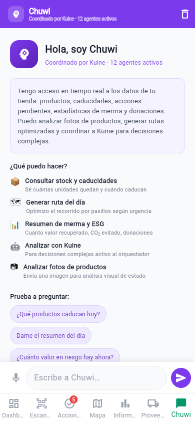<br/><b>Modo ruta GPS</b><br/>Acción por acción</td>
<td align="center">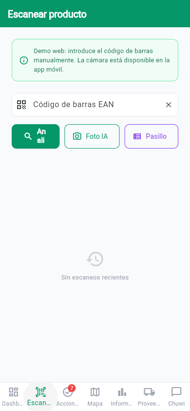<br/><b>Scan por foto</b><br/>Vision Agent IA</td>
</tr>
</table>

</div>

**Sin instalar nada extra** — el encargado ya tiene Telegram. Streaming real: el texto aparece mientras Claude genera.

### 30+ comandos organizados por rol

<details>
<summary><b>📋 Comandos públicos (sin login)</b></summary>

| Comando | Función |
|---------|---------|
| `/start` | Onboarding con menú principal y botones inline |
| `/yo` | Perfil: nombre, rol, tienda asignada |
| `/menu` | Menú principal con accesos rápidos |
| `/estado` | Semáforo verde/amarillo/rojo de la tienda |
| `/ayuda` | Guía completa con ejemplos |
| `/agentes` | Estado de los 12 agentes en tiempo real |
| `/kuine` | Información detallada del orquestador |

</details>

<details>
<summary><b>⚡ Comandos operativos (empleados)</b></summary>

| Comando | Función |
|---------|---------|
| `/acciones` | Lista pendientes por urgencia, botones Confirmar/Donar/Escalar |
| `/criticos` | Solo acciones score ≥ 85 — vista rápida urgente |
| `/ruta` | Ruta diaria optimizada por pasillos · modo guiado GPS de tienda |
| `/brief` | Brief diario de Kuine — análisis completo |
| `/hoy` | Resumen del día: ventas, merma, acciones, donaciones |
| `/scan` | Escanear foto o barcode — Vision + Kuine → acción automática |
| `/merma` | Registrar merma manualmente |
| `/donaciones` | Resumen mes + flujo guiado nueva donación |
| `/prediccion` | Predicción merma 7 días (Haiku + Open-Meteo) |
| `/mapa` | Mapa por pasillos: productos próximos a caducar |
| `/historial` | Acciones completadas últimos 7 días |
| `/merma7` | Proyección merma a 7 días |
| `/tiempo` | Tiempo actual (Open-Meteo) + previsión 5 días |

</details>

<details>
<summary><b>👔 Comandos manager</b></summary>

| Comando | Función |
|---------|---------|
| `/proveedores` | Ficha con merma histórica por proveedor |
| `/pedido` | Pedido semanal generado por IA |
| `/esg` | Informe ESG: CO2, agua, donaciones, CSRD 2026 |
| `/insights` | Insights estratégicos (Sonnet 4.6) |
| `/semana` | Resumen semanal vs. semana anterior |
| `/informe` | Informe completo del mes |
| `/costes` | Análisis costes por categoría |
| `/simular` | Panel demo: brief · check · cierre · alerta · escalación |

</details>

### Scheduler — 15 trabajos autónomos

| Hora / Frecuencia | Job | Función |
|-------------------|-----|---------|
| 07:30 diario | Brief diario | Kuine analiza toda la tienda, Chuwi envía streaming |
| 12:00 diario | Check mediodía | Escala si hay críticos sin resolver |
| 20:00 diario | Cierre | Resumen real del día + merma efectiva |
| Cada 30min (8-21h) | Monitor | Alertas proactivas + propuesta donación |
| Cada 2h (8-20h) | Escalación | Escala acciones score≥85 sin resolver >4h |
| Lunes 06:00 | Semanal | Informe completo + PDF adjunto |
| Día 1 08:00 | Mensual | Informe mensual + PDF |

---

## 🧠 Los 12 Agentes de IA

### Right-sizing: modelo correcto para cada tarea

```
Kuine (Opus 4.7)          ← orquestador, 16 tools, 20 iter, extended thinking
├── Evaluador (Sonnet 4.6) ← score 0-100, thinking adaptativo (solo en zona 65-90)
│   └── Consenso (3×Sonnet) ← 3 instancias paralelas, regla 2/3, para score≥90 Y valor≥30€
├── Validador (Sonnet 4.6) ← 23 ataques adversariales, 100% bloqueados
├── ForkMerge (3×Sonnet + Opus síntesis) ← para valor>50€ o lote caducado
│   ├── Rama clearance — descuento agresivo
│   ├── Rama margin — proteger margen
│   └── Rama donation — impacto social + deducción fiscal
├── Predictor (Haiku 4.5) ← Open-Meteo + historial merma
├── Visión (Haiku 4.5)    ← análisis de fotos de producto
├── Reportero (Sonnet 4.6) ← briefs + resúmenes + PDFs
├── Notificador (python-tg-bot) ← alertas proactivas horario 8-21h
├── Chuwi (Sonnet 4.6)    ← agente conversacional Telegram, streaming
├── Precio (heurístico)   ← descuento lineal días×categoría, 0 tokens
└── Stock (heurístico)    ← FEFO automático, 0 tokens
```

### Técnicas implementadas

| Técnica | Implementación | Referencia |
|---------|---------------|------------|
| **Loop agéntico** | Kuine: 20 iter, 16 tools, tool_result loop | Anthropic, 2024 |
| **Fork-Merge** | 3 ramas paralelas + síntesis Opus | Building Effective Agents |
| **Extended thinking** | Evaluador: solo zona ambigua 65-90 | Anthropic, 2025 |
| **Reflexion Loop** | Chuwi aprende de cada interacción, 5 lecciones | Shinn et al., 2023 |
| **Intent 0-token** | 10 intents por keywords antes de LLM, ~60% ahorro | — |
| **Prompt caching** | `cache_control: ephemeral`, TTL 5min, ~85% ahorro | Anthropic |
| **Consenso paralelo** | 3×Sonnet en ThreadPoolExecutor, regla 2/3 | — |
| **Validación adversarial** | 23 ataques bloqueados (inject, bypass FEFO, precio<coste…) | — |
| **RAG normativo** | pgvector 1536 dim, CE 178/2002, Ley 7/2022 | — |
| **Streaming async** | AsyncAnthropic + Telegram edit progresivo | — |

---

## 📊 Resultados

<div align="center">

| Métrica | Valor |
|---------|-------|
| 🧪 Tests automatizados | **774 / 774** (< 2s, sin API real) |
| 🎯 Precisión del sistema | **100%** |
| 📈 Mejora sobre baseline sin IA | **+83,3 puntos porcentuales** |
| 🛡️ Ataques adversariales bloqueados | **23 / 23** |
| 💰 Merma identificada (datos reales) | **483,95 EUR** |
| ✅ Acciones completadas | **45** |
| 💸 Coste operativo real/mes | **~0,80 EUR** (con prompt caching) |
| 📈 ROI estimado | **> 500:1** |

</div>

### Comparativa con el mercado

| Criterio | **MermaOps** | Winnow V2 | Orbisk | Manual |
|----------|-------------|-----------|--------|--------|
| Coste implantación | **0 EUR** | >20.000 EUR | >15.000 EUR | 0 EUR |
| Coste operativo/mes | **~0,80 EUR** | ~300 EUR | ~250 EUR | ~120 EUR |
| Hardware requerido | **Ninguno** | Báscula+cámara | Cámara+servidor | Ninguno |
| Autonomía 24/7 | **Sí (15 crons)** | Parcial | Parcial | No |
| Normativa CSRD | **Sí (RAG)** | No | No | No |
| Multi-agente IA | **12 agentes** | No | No | No |

---

## 🏗️ Stack técnico

```
Backend     Python 3.14 · FastAPI · Uvicorn · Puerto 8001
IA          Claude API · Opus 4.7 / Sonnet 4.6 / Haiku 4.5
Base datos  Supabase (PostgreSQL + Auth + Realtime + pgvector 1536 dim)
App         Flutter + Dart · Riverpod · GoRouter · ShellRoute
Telegram    python-telegram-bot 21+ · Polling · Inline keyboards
Scheduler   APScheduler · 15 jobs cron 07:00–21:30
PDF         fpdf2 · 6 tipos de PDF generados server-side
Clima       Open-Meteo API · Sin API key · Coordenadas GPS tienda
Tests       pytest · 774/774 · < 2s · Sin conexión real
```

---

## ⚡ Quick Start

### 1. Variables de entorno

```bash
cp .env.example .env
```

```env
ANTHROPIC_API_KEY=sk-ant-...
SUPABASE_URL=https://XXXX.supabase.co
SUPABASE_KEY=eyJ...
SUPABASE_SERVICE_KEY=eyJ...
TELEGRAM_BOT_TOKEN=123456:ABC...
STORE_ID=demo-store-001
APP_PORT=8001
```

### 2. Instalar y arrancar

```bash
pip install -r requirements.txt
make seed        # datos demo
make start       # verifica .env → Supabase → Telegram → arranca en puerto 8001
```

### 3. App Flutter

```bash
make flutter-run   # imprime el comando con variables del .env
```

### Comandos útiles

```bash
make start          # verificar + arrancar backend
make verify         # solo verificar sin arrancar
make check          # diagnóstico completo (con backend corriendo)
make seed           # datos demo
make advance N=2    # simula 2 días de paso del tiempo
make brief          # fuerza generación de brief ahora
make test           # 774 tests
```

---

## 📁 Estructura

```
mermaops/
├── backend/
│   ├── agents/
│   │   ├── supervisor.py      # Kuine — orquestador, 16 tools, adaptive thinking
│   │   ├── evaluator.py       # Score 0-100 con extended thinking adaptativo
│   │   ├── consensus.py       # 3 instancias paralelas, regla 2/3
│   │   ├── validator.py       # 23 ataques adversariales, 100% bloqueados
│   │   ├── fork_merge.py      # 3 ramas paralelas + síntesis Opus
│   │   ├── predictor.py       # Predicciones + Open-Meteo
│   │   ├── vision.py          # Análisis visual Claude Vision
│   │   ├── reporter.py        # Briefs + PDFs
│   │   └── notifier.py        # Alertas Telegram proactivas
│   ├── core/
│   │   ├── chuwi.py           # Agente Telegram (streaming, 30+ cmds, modo ruta)
│   │   ├── chuwi_commands.py  # Comandos /mapa /historial /merma7 /tiempo...
│   │   ├── scheduler.py       # 15 jobs cron autónomos
│   │   ├── pdf_generator.py   # 6 tipos de PDF con fpdf2
│   │   └── database.py        # Supabase queries
│   ├── api/routes.py          # 40+ endpoints REST
│   └── tests/                 # 774 tests
├── app/                       # Flutter — 9 pantallas
├── docs/
│   └── pdf/
│       └── MermaOps_Sistema_Completo.pdf   # Documentación técnica completa
├── generate_master_pdf.py     # Generador del PDF técnico
├── Makefile
└── CLAUDE.md
```

---

## 🌱 ESG y Normativa

MermaOps cumple **CSRD 2026** de forma nativa — la normativa está indexada en pgvector y el Validador la consulta en cada decisión.

| Normativa | Cobertura |
|-----------|-----------|
| **Reglamento (CE) 178/2002** | Nunca vender caducado — bloqueado por Validador |
| **Ley 7/2022** | Residuos y economía circular — tracking CO2 |
| **Ley 49/2002 Art. 20** | Deducción fiscal 35% en donaciones — calculada automáticamente |
| **CSRD 2026** | CO2, agua, trazabilidad IA, impacto social — todo registrado |

**Cuando un producto lleva >6h en CRÍTICO sin acción**, Kuine propone donación con un toque:

```
CRÍTICO · Pan artesano · Pasillo 1 · Caduca hoy · 12 unidades

[ ❤️ Banco de Alimentos ]  [ 🤝 Cáritas ]
[ 🏥 Cruz Roja ]           [ 💰 Mejor rebajar ]
```

Deducción fiscal calculada al instante · CO2 evitado registrado · CSRD cubierto.

---

## 📄 Documentación técnica

El PDF completo del sistema (29 páginas, con capturas reales, diagramas y explicación de todos los agentes) está disponible en:

👉 [`docs/pdf/MermaOps_Sistema_Completo.pdf`](docs/pdf/MermaOps_Sistema_Completo.pdf)

---

<div align="center">

**MermaOps · Álvaro Ferrer Margarit**  
TFM · Máster en IA Generativa e Innovación · Evolve Business School · 2026

MIT License

</div>
