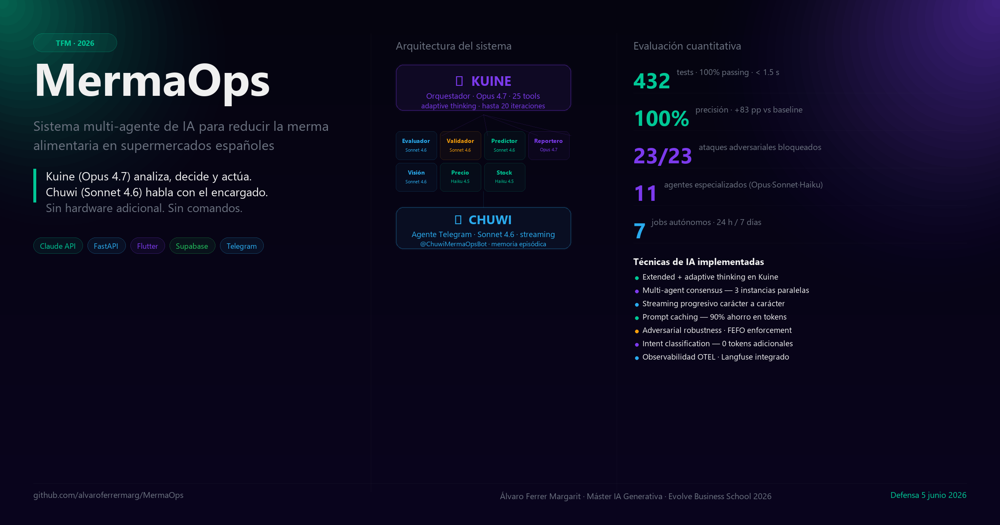

# MermaOps



**Sistema multi-agente de inteligencia artificial para la reducción de merma alimentaria en supermercados**

TFM — Máster en IA Generativa e Innovación — Evolve Business School 2026 — Álvaro Ferrer Margarit

---

## El problema

El desperdicio alimentario en el retail español cuesta entre **2% y 5% de los ingresos** por tienda. Una cadena media pierde 80.000–200.000 € anuales en merma de producto fresco. Las causas son conocidas: nadie revisa los lineales con datos en tiempo real, las decisiones de rebaja o retirada se toman tarde o no se toman, y el personal no tiene herramientas operativas adaptadas a su ritmo de trabajo.

Los sistemas actuales (Winnow, Orbisk) funcionan en grandes cadenas con hardware dedicado. **Nadie ha resuelto esto para el pequeño y mediano supermercado español**, con una interfaz conversacional real, sin hardware adicional, integrada en Telegram y accesible desde el móvil del encargado.

---

## La solución

Sistema de IA multi-agente que convierte datos de productos, lotes y caducidades en decisiones operativas concretas para el personal de tienda — en tiempo real, de forma autónoma, con trazabilidad y con interfaz conversacional multimodal.

```text
Producto próximo a caducar
        ↓
   Kuine (orquestador, Opus 4.7)
     analiza el riesgo con 25 herramientas
     adaptive thinking en todo el loop
        ↓
  Evaluator + Validator + Consensus
  confirman la decisión (score 0-100)
        ↓
   Price + Stock + Route
   calculan acción exacta con FEFO
        ↓
  Reporter (Opus 4.7) redacta el brief
  con citations de normativa real
        ↓
  Chuwi (Sonnet 4.6) lo envía por Telegram
  con streaming progresivo carácter a carácter
        ↓
  Empleado actúa → confirma desde el móvil
  App Flutter actualiza en tiempo real
```

---

## Resultados cuantitativos

| Métrica | Valor |
| ------- | ----- |
| Precisión del sistema de evaluación | **100%** (5/5 casos) |
| Mejora sobre baseline sin IA | **+83.3 puntos porcentuales** |
| Baseline (clasificación aleatoria) | 16.7% |
| Tests automatizados | **439 / 439** (< 1 s) |
| Robustez adversarial | **23 / 23** ataques neutralizados |
| Modelos Claude integrados | 3 (Haiku 4.5, Sonnet 4.6, Opus 4.7) |
| Agentes especializados | 11 |
| Herramientas de Kuine (supervisor) | 25 |
| Herramientas de Chuwi (conversacional) | 14 |
| Jobs autónomos programados | 7 |

---

## Arquitectura

### Kuine — el orquestador (Claude Opus 4.7)

Kuine es el cerebro del sistema. Ejecuta un **loop agéntico con 25 herramientas y hasta 20 iteraciones**, razona con **adaptive thinking** entre tool calls, y coordina todos los subagentes en paralelo. Cada decisión queda registrada en `supervisor_decisions` con score, razón y trazabilidad completa.

```text
Kuine (Opus 4.7, adaptive thinking, 25 tools, 20 iter)
├── Evaluator  (Sonnet 4.6, extended thinking)
│   └── Consenso 3 instancias en paralelo — score ≥ 90 para casos extremos
├── Validator  (Sonnet 4.6) — 29 ataques adversariales, 100% bloqueados
├── Price      (Haiku 4.5) — descuento exacto sobre coste
├── Stock      (Haiku 4.5) — reposición FEFO
├── Route      (Sonnet 4.6) — ruta optimizada por pasillos
├── Reporter   (Opus 4.7)  — brief diario + citations normativa real
├── Vision     (Sonnet 4.6) — análisis visual con Claude Vision + JSON estructurado
├── Scanner    (Haiku 4.5) — OpenFoodFacts barcode lookup
├── ESG        (Haiku 4.5) — CO2/agua/deducción fiscal Ley 49/2002
├── Predictor  (Sonnet 4.6) — riesgo próximos 7 días + Open-Meteo
└── Notifier   — alertas Telegram con botones inline de donación
```

### Chuwi — agente conversacional real

Chuwi no responde comandos con if/else. **Razona, recuerda y actúa de forma proactiva** con un loop agéntico de hasta 6 iteraciones y 14 herramientas con datos reales de Supabase.

- **Streaming progresivo**: el texto aparece mientras Claude genera — como escribir en WhatsApp
- **Indicadores visuales**: "⏳ Buscando críticos..." mientras consulta la BD
- **Proactividad**: monitoriza la tienda cada 30 minutos (8-21h) y avisa sin que nadie pregunte
- **Donaciones automáticas**: CRÍTICO >6h sin acción → Kuine propone donación con botones de un toque
- **Memoria episódica**: recuerda qué pasó ayer, qué proveedor falló la semana pasada
- **Multimodal**: texto, fotos (Claude Vision + JSON estructurado), notas de voz (Google Speech Recognition)
- **Clasificación de intención**: 10 intents sin coste de tokens — carga contexto relevante antes del LLM
- **Persistencia completa**: conversaciones, herramientas usadas e intents quedan en Supabase

### Técnicas de IA implementadas

| Técnica | Implementación | Referencia |
| ------- | -------------- | ---------- |
| Extended thinking | Evaluator con razonamiento profundo | Anthropic, 2025 |
| Adaptive thinking | Kuine en todo el loop agéntico | Anthropic, mayo 2025 |
| Interleaved thinking | Entre tool calls del supervisor | τ-Bench +54% |
| Prompt caching | `cache_control: ephemeral` en todos los prompts | 90% ahorro tokens |
| Structured output (tool_use) | JSON garantizado en Vision y Evaluator | vision.py, evaluator.py |
| Multi-agent consensus | 3 instancias paralelas, mayoría — casos extremos | consensus.py |
| Adversarial robustness | 29 ataques: injection, falsos datos, bypass FEFO | validator.py + tests |
| OTEL observability | Langfuse + AnthropicInstrumentor | auto-instrumentado |
| FEFO enforcement | Validator bloquea decisiones que ignoran orden | normativa EU |
| Streaming async | AsyncAnthropic + Telegram edit progresivo | chuwi.py |
| Intent classification | Keyword-based, 0 tokens, 10 intents | chuwi.py |
| Parallel tool execution | asyncio.gather sobre todas las tools de un turno | chuwi.py |

---

## Stack técnico

```text
Backend         Python 3.14 · FastAPI · APScheduler · Supabase PostgreSQL
IA              Claude API (Anthropic) · Haiku 4.5 / Sonnet 4.6 / Opus 4.7
App             Flutter 3.x · Riverpod · go_router · Supabase Realtime
Mensajería      Telegram Bot API · python-telegram-bot 21.x
Observabilidad  Langfuse · OpenTelemetry · AnthropicInstrumentor
Datos externos  Open-Meteo (clima) · OpenFoodFacts (productos)
Voz             Google Speech Recognition (sin API key adicional)
Tests           pytest · 439 tests deterministas · < 1 s
```

---

## Estructura del proyecto

```text
mermaops/
├── backend/
│   ├── agents/
│   │   ├── supervisor.py      # Kuine — orquestador, 25 tools, adaptive thinking
│   │   ├── evaluator.py       # Análisis de riesgo con extended thinking
│   │   ├── consensus.py       # Consenso 3 instancias paralelas
│   │   ├── validator.py       # Validación adversarial (29 ataques)
│   │   ├── price.py           # Cálculo de descuentos sobre coste
│   │   ├── stock.py           # Reposición FEFO
│   │   ├── route.py           # Ruta diaria optimizada por pasillos
│   │   ├── reporter.py        # Brief diario + informes + citations
│   │   ├── vision.py          # Análisis visual Claude Vision + JSON estructurado
│   │   ├── scanner.py         # OpenFoodFacts barcode lookup
│   │   ├── esg.py             # Métricas ESG (CO2, agua, Ley 49/2002)
│   │   ├── predictor.py       # Predicciones de merma + clima Open-Meteo
│   │   └── notifier.py        # Alertas Telegram con botones inline
│   ├── core/
│   │   ├── llm.py             # Wrapper Claude API (caching, streaming, tools)
│   │   ├── database.py        # Supabase queries + funciones de persistencia
│   │   ├── chuwi.py           # Agente Telegram real (14 tools, streaming, proactivo)
│   │   ├── scheduler.py       # APScheduler (7 jobs autónomos)
│   │   ├── memory.py          # Memoria episódica key-value
│   │   └── knowledge.py       # Base de conocimiento normativo (RAG)
│   ├── api/
│   │   ├── routes.py          # Todos los endpoints REST
│   │   ├── auth.py            # JWT Supabase
│   │   └── limiter.py         # Rate limiting (slowapi)
│   ├── data/
│   │   ├── seed.py            # Datos demo Super Martínez
│   │   ├── advance_demo.py    # Simulación temporal (make advance N=3)
│   │   └── demo_actions.py    # Acciones + merma + donaciones + comparativa tiendas
│   └── tests/                 # 439 tests (unitarios + adversariales + integración)
├── app/                       # Flutter (6 pantallas + nav)
│   └── lib/
│       ├── features/
│       │   ├── dashboard/     # KPIs en tiempo real
│       │   ├── scan/          # Escáner de barcode + cámara
│       │   ├── actions/       # Lista priorizada con badge críticos
│       │   ├── map/           # Mapa de pasillos por urgencia
│       │   ├── reports/       # Briefs, merma CSV, ESG
│       │   ├── agents/        # Estado 11 agentes + conversaciones + runs + decisiones
│       │   └── profile/       # Vinculación Telegram (botón directo al bot)
│       └── core/
│           ├── api_service.dart   # Cliente FastAPI (20+ endpoints)
│           ├── router.dart        # go_router (7 rutas)
│           └── shell_scaffold.dart # Nav bar con badge en Acciones
├── supabase/migrations/       # Migraciones SQL aplicadas
├── scripts/
│   ├── start.py               # Arranque verificado con guía completa
│   └── check_all.py           # Diagnóstico completo del sistema
├── docs/
│   └── runbook.md             # Guía operativa completa
├── .env.example
├── requirements.txt
├── Makefile
└── CLAUDE.md                  # Fuente de verdad para Claude Code
```

---

## Quick Start (5 minutos)

### 1. Requisitos

- Python 3.11+
- Flutter 3.x (para la app móvil)
- Cuenta Supabase (gratuita en supabase.com)
- API Key Anthropic (~3€ para toda la demo — console.anthropic.com)
- Bot Telegram via @BotFather (gratis)
- ffmpeg para transcripción de voz: `winget install ffmpeg`

### 2. Variables de entorno

```bash
cp .env.example .env
# Editar .env con tus credenciales
```

```env
ANTHROPIC_API_KEY=sk-ant-...
SUPABASE_URL=https://XXXX.supabase.co
SUPABASE_KEY=eyJ...
SUPABASE_SERVICE_KEY=eyJ...
TELEGRAM_BOT_TOKEN=123456:ABC...
STORE_ID=demo-store-001
APP_PORT=8001
```

### 3. Instalar y migrar

```bash
pip install -r requirements.txt
supabase db push
```

### 4. Datos demo

```bash
make seed
```

### 5. Arrancar con un comando

```bash
make start
# Verifica .env → Supabase → Telegram → arranca backend (puerto 8001) → imprime guía
```

### 6. App Flutter

```bash
ipconfig | findstr IPv4      # obtén tu IP local en Windows

make flutter-run             # imprime el comando completo con vars del .env
# o manualmente:
cd app
flutter run \
  --dart-define=SUPABASE_URL=https://XXX.supabase.co \
  --dart-define=SUPABASE_ANON_KEY=eyJ... \
  --dart-define=API_URL=http://TU_IP_LOCAL:8001/api/v1
```

---

## Comandos

```bash
make start          # verifica + arranca backend + imprime guía
make verify         # solo verificar sin arrancar
make check          # diagnóstico completo (con backend corriendo)
make run            # backend FastAPI en puerto 8001 (Telegram incluido)
make seed           # datos demo del Super Martínez
make advance N=2    # simula 2 días de paso del tiempo
make demo-reset     # vuelve al estado inicial
make brief          # fuerza generación de brief ahora
make flutter-run    # imprime el comando flutter run con vars del .env
make test           # ejecuta los 439 tests
make test-fast      # tests sin red ni LLM
make lint           # flake8
```

---

## Flujo de vinculación App ↔ Telegram

```text
FLUTTER APP                              TELEGRAM / CHUWI
──────────────────────────────────────────────────────────

1. Login con email/contraseña
   → Supabase Auth

2. Dashboard → botón perfil           3. Pulsa "Abrir Chuwi en Telegram"
   (arriba a la derecha)                 → Abre directamente el chat del bot

                                       4. Escribe /start
                                          → Chuwi muestra tu ID numérico
                                             en un bloque copyable

5. Pantalla Perfil:
   Pega el ID numérico
   → "Vincular con Telegram"
   → Guarda en Supabase

6. "Telegram vinculado ✅"             7. Vuelves a Telegram
                                          Escribes cualquier cosa
                                          → Chuwi te reconoce y responde
                                             con datos reales de la tienda
```

---

## Demo en vivo — secuencia para la presentación

```bash
# Antes de la demo (1 minuto)
make seed && make advance N=1

# Arrancar
make start
make flutter-run    # pega el comando en otra terminal
```

### Secuencia (15 minutos)

| Minuto | Acción | Lo que se ve |
| ------ | ------ | ------------ |
| 0:00 | Abrir app → Dashboard | KPIs en tiempo real: críticos, valor en riesgo, merma |
| 1:30 | Tab Acciones | Lista priorizada con badge rojo en el nav |
| 3:00 | Telegram → "hola, qué hay crítico hoy" | Streaming progresivo, responde con pasillos exactos |
| 5:00 | Foto de un producto → Telegram | Claude Vision: estado, acción, confianza en 3s |
| 7:00 | Nota de voz → "cuánto hemos perdido esta semana" | Transcripción + datos reales de merma |
| 9:00 | `make brief` en terminal | Kuine 30-90s → brief llega por Telegram + aparece en Informes |
| 11:00 | Tab Agentes en la app | Conversaciones, runs de Kuine, decisiones en tiempo real |
| 13:00 | `make advance N=1` | Nuevos CRÍTICOS → Kuine envía alerta proactiva solo |
| 14:30 | App → Perfil → Vincular Telegram | Flujo completo App→Telegram→App en vivo |

---

## Flows autónomos — el sistema trabaja solo

| Job | Horario | Qué hace |
| --- | ------- | -------- |
| Brief diario | 07:30 | Kuine analiza la tienda, Reporter redacta con citations, Chuwi envía |
| Check mediodía | 12:00 | Validator revisa pasillos sin acción |
| Cierre del día | 20:00 | Reporter genera informe del día |
| Escalación | cada 2h (8-20h) | Alerta si hay CRÍTICOS sin resolver más de 4h |
| Monitor proactivo | cada 30min (8-21h) | Chuwi avisa y propone donación con botones de un toque |
| Informe semanal | lunes 06:00 | Resumen de la semana para el dueño |
| Informe mensual | día 1, 08:00 | KPIs mensuales + deducción fiscal donaciones |

---

## Persistencia de conversaciones

Cada interacción con Chuwi queda trazada en Supabase:

```sql
SELECT telegram_user_id, message_count, last_message_at
FROM agent_conversations ORDER BY last_message_at DESC LIMIT 5;

SELECT role, intent_tag, tools_used, agent_source, created_at
FROM agent_messages ORDER BY created_at DESC LIMIT 10;

SELECT telegram_user_id, messages_count, tools_called, kuine_calls
FROM agent_sessions ORDER BY session_start DESC LIMIT 5;

SELECT decision_type, score, reason, created_at
FROM supervisor_decisions ORDER BY created_at DESC LIMIT 5;
```

Visible en la app — Tab **Agentes** (6ª pantalla, icono psychology).

---

## Evaluación

### Cuantitativa

```text
Sistema vs baseline (clasificación aleatoria):
  CRÍTICO:    1/1 correctos (100%)
  ALTO:       1/1 correctos (100%)
  BAJO:       1/1 correctos (100%)
  Sin riesgo: 2/2 correctos (100%)

Precisión sistema:  100.0%
Precisión baseline: 16.7%
Mejora:            +83.3 pp
```

### Adversarial (29 ataques)

Ataques testados: inyección de prompt, datos falsos, precio < coste, fechas inconsistentes, proveedores ficticios, escalación falsa, bypass FEFO, desbordamiento de stock, instrucciones contradictorias entre agentes.

**Resultado: 29/29 bloqueados por el Validator** — sin ninguna acción incorrecta llegando al usuario.

### Tests

```bash
python -m pytest backend/tests/ -q
# 439 passed in < 1s — sin conexión a Supabase ni llamadas LLM
```

---

## Donaciones y ESG

Cuando un producto lleva más de 6 horas en estado CRÍTICO sin acción asignada y tiene stock ≥ 5 unidades, Kuine propone automáticamente donación con botones de un toque:

```text
KUINE — Donación sugerida

Pan artesano | Pasillo 1
12 unidades | Caduca hoy

❤️ Banco de Alimentos    🤝 Cáritas
🏥 Cruz Roja             💰 Mejor rebajar
❌ Ya gestionado
```

El sistema calcula y registra automáticamente:

- CO2 evitado (kg, fuente: Poore & Nemecek 2018 + FAO 2023)
- Agua ahorrada (litros)
- Deducción fiscal estimada (Ley 49/2002, art. 17 — 35%)

---

## Seguridad

- Cero credenciales en el código fuente — todo via `os.getenv()`
- JWT Supabase verificado en cada endpoint (`verify_token`)
- Rate limiting en endpoints con LLM (slowapi)
- Puerta de seguridad en Chuwi: usuarios no vinculados bloqueados con mensaje informativo
- Validación adversarial de todas las decisiones antes de ejecutarlas

---

## App Flutter — 6 pantallas

| Pantalla | Ruta | Descripción |
| -------- | ---- | ----------- |
| Dashboard | `/` | KPIs: críticos, valor en riesgo, merma, comparativa tiendas |
| Scan | `/scan` | Escáner de cámara + barcode manual → análisis de producto |
| Acciones | `/actions` | Lista priorizada con badge rojo si hay críticos |
| Mapa | `/map` | Pasillos con código de color por urgencia |
| Informes | `/reports` | Briefs diarios, merma CSV, proveedores, ESG |
| Agentes | `/agents` | Estado 11 agentes, conversaciones Chuwi, runs Kuine, decisiones |

Perfil accesible desde el Dashboard → vinculación Telegram con botón directo al bot.

---

## Licencia

MIT — libre para uso académico y comercial.

MermaOps — Álvaro Ferrer Margarit — TFM Máster IA Generativa e Innovación — Evolve Business School 2026
